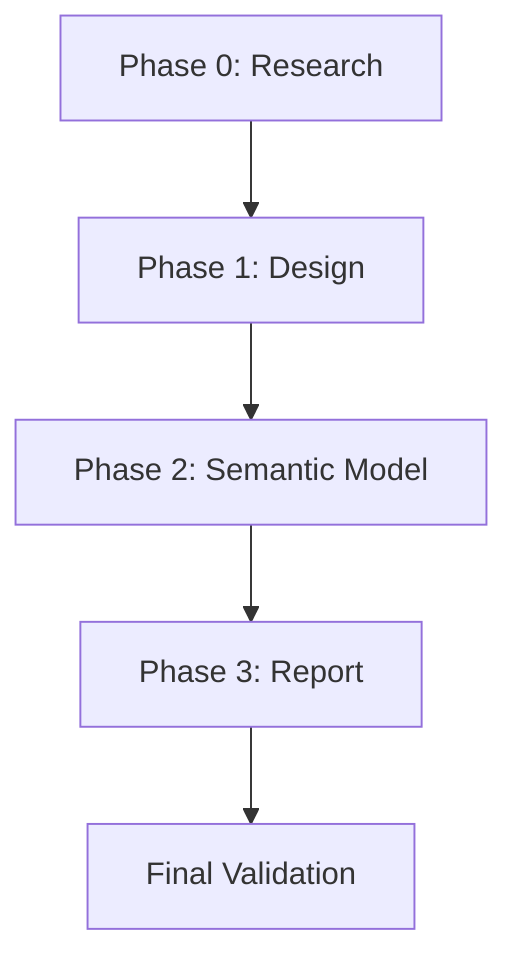

# Implementation Plan: Sales & Customer Dashboards — Tableau → Power BI Migration

**Branch**: `007-sales-customer-pbi` | **Date**: 2026-06-04 | **Spec**: [spec.md](specs/001-sales-customer-pbi/spec.md)
**Input**: Feature specification from `specs/001-sales-customer-pbi/spec.md`

## Summary

Migrate the "Sales & Customer Dashboards" Tableau workbook (4 CSV sources, 28+ calculated fields, 2 dashboards) to a complete Power BI PBIP project. The semantic model uses a star schema (FactOrders + 4 dimensions + 1 parameter table), 39 DAX measures across 8 display folders, and 5 relationships. The report layer produces 2 pages (Sales Dashboard, Customer Dashboard) with KPI line charts, bar charts, tables, slicers, and navigation buttons.

## Technical Context

**Language/Version**: Power BI PBIP format (TMDL + PBIR JSON), M query (Power Query), DAX  
**Primary Dependencies**: Power BI Desktop (June 2024+), TMDL format, PBIR enhanced report format  
**Storage**: CSV files (semicolon-delimited, German locale en_DE, UTF-8/Windows-1252 encoding)  
**Testing**: `tmdl-validate` (structural TMDL linter), `validate_pbip.py` (cross-cutting PBIP validator), Power BI Desktop open test  
**Target Platform**: Power BI Desktop / Power BI Service (Import mode)  
**Project Type**: Power BI semantic model + report (PBIP project)  
**Performance Goals**: All tables <100K rows; Import mode; sub-second measure evaluation  
**Constraints**: No DirectQuery, no composite models, no incremental refresh needed  
**Scale/Scope**: ~10K order rows, 793 customers, 1862 products, 631 locations; 2 report pages, 39 measures

## Constitution Check

*GATE: Must pass before Phase 0 research. Re-check after Phase 1 design.*

| # | Rule | Status | Evidence |
|---|------|--------|----------|
| §0 | Single-Table Rule — DO NOT decompose single flat file | ✅ PASS | Multiple source tables (4 CSVs with explicit joins) → star schema decomposition is correct |
| §1 | Star Schema — fact/dim decomposition for multi-table | ✅ PASS | FactOrders + DimCustomer + DimLocation + DimProduct + DimDate + SelectYear |
| §2 | Naming Conventions — Fact/Dim prefix, PascalCase | ✅ PASS | FactOrders, DimCustomer, DimLocation, DimProduct, DimDate, SelectYear |
| §3 | DAX Standards — DIVIDE(), VAR/RETURN, display folders | ✅ PASS | All 39 measures use DIVIDE(), VAR/RETURN pattern, 8 display folders |
| §4 | Relationships — many-to-one, single direction, no circular | ✅ PASS | 5 relationships (4 active + 1 inactive), all single-direction dim→fact |
| §5 | M Query — QuoteStyle.Csv, independent loads, no cross-refs | ✅ PASS | Each table loads independently from CSV; QuoteStyle.Csv + Delimiter=";" |
| §6 | Performance — Import mode, natural text keys for small model | ✅ PASS | <100K rows, text natural keys acceptable |
| §7 | Parameters — disconnected DATATABLE for integer list | ✅ PASS | SelectYear as DATATABLE with Year values + SELECTEDVALUE |
| §8 | PBIP Output Structure — correct folder layout | ✅ PASS | Standard .pbip/.SemanticModel/.Report structure |
| §9 | Report Visual Rules — no grey space, borders, alt text | 🔲 PENDING | Will verify during Phase 3 report generation |
| §10 | Validation Checklist — all items checked | 🔲 PENDING | Will run validators after generation |

**Gate Result**: ✅ PASS — All applicable rules satisfied. Proceeding to Phase 0.

## Project Structure

### Documentation (this feature)

```text
specs/001-sales-customer-pbi/
├── plan.md              # This file
├── research.md          # Phase 0 — M query patterns, TMDL syntax research
├── data-model.md        # Phase 1 — Entity model with fields and relationships
├── quickstart.md        # Phase 1 — How to open and validate the output
├── contracts/           # Phase 1 — PBIP file contracts (TMDL schema)
└── tasks.md             # Phase 2 — Implementation tasks (generated by /speckit.tasks)
```

### Source Code (Output artifacts)

```text
Output/SalesCustomerDashboards/
├── SalesCustomerDashboards.pbip
├── SalesCustomerDashboards.SemanticModel/
│   ├── definition.pbism
│   ├── diagramLayout.json
│   └── definition/
│       ├── database.tmdl
│       ├── model.tmdl
│       ├── relationships.tmdl
│       └── tables/
│           ├── FactOrders.tmdl
│           ├── DimCustomer.tmdl
│           ├── DimLocation.tmdl
│           ├── DimProduct.tmdl
│           ├── DimDate.tmdl
│           └── SelectYear.tmdl
└── SalesCustomerDashboards.Report/
    ├── definition.pbir
    └── definition/
        ├── report.json
        ├── version.json
        └── pages/
            ├── pages.json
            ├── SalesDashboard/
            │   ├── page.json
            │   └── visuals/
            │       └── {visual_name}/visual.json
            └── CustomerDashboard/
                ├── page.json
                └── visuals/
                    └── {visual_name}/visual.json
```

**Structure Decision**: Standard PBIP folder structure per constitution §8. Output to `Output/SalesCustomerDashboards/`. Source data remains in `Data/Sales and Customer/`.

## Complexity Tracking

> No constitution violations — no justification needed.

---

## Phase 0: Research (Complete)

**Output**: [research.md](specs/001-sales-customer-pbi/research.md)

All technical unknowns resolved:
- M query CSV pattern with German locale (semicolon delimiter, per-file encoding, culture in type conversion)
- TMDL relationship syntax (camelCase properties, oneDirection, single file)
- DimDate generation (fixed range, List.Dates, no cross-query references)
- SelectYear DAX DATATABLE pattern
- Navigation buttons (actionButton + PageNavigation)
- Cross-filter actions (native Power BI behavior, no config)

---

## Phase 1: Design (Complete)

**Outputs**:
- [data-model.md](specs/001-sales-customer-pbi/data-model.md) — 6 tables, 5 relationships, 39 measures
- [contracts/pbip-contracts.md](specs/001-sales-customer-pbi/contracts/pbip-contracts.md) — PBIP file schemas
- [quickstart.md](specs/001-sales-customer-pbi/quickstart.md) — Validation steps

### Constitution Re-Check (Post-Design)

| # | Rule | Status |
|---|------|--------|
| §0 | Single-Table Rule | ✅ PASS — 4 source tables → decomposition correct |
| §1 | Star Schema | ✅ PASS — FactOrders central, 4 dims, natural keys |
| §2 | Naming | ✅ PASS — FactOrders, DimCustomer, DimLocation, DimProduct, DimDate |
| §3 | DAX Standards | ✅ PASS — DIVIDE(), VAR/RETURN, display folders, no implicit measures |
| §4 | Relationships | ✅ PASS — 5 many-to-one, single direction, 1 inactive, no circular |
| §5 | M Query | ✅ PASS — QuoteStyle.Csv, independent loads, absolute paths, culture |
| §6 | Performance | ✅ PASS — Import mode, text keys appropriate for <100K rows |
| §7 | Parameters | ✅ PASS — SelectYear as disconnected DATATABLE |
| §8 | PBIP Structure | ✅ PASS — All required files in correct locations |

---

## Phase 2: Semantic Model Implementation

**Goal**: Generate all TMDL files for the semantic model.

| Task | File | Description |
|------|------|-------------|
| 2.1 | `SalesCustomerDashboards.pbip` | Root project file |
| 2.2 | `definition.pbism` | Semantic model definition pointer |
| 2.3 | `database.tmdl` | Database metadata (compatibilityLevel 1604) |
| 2.4 | `model.tmdl` | Model config (culture, annotations, query order) |
| 2.5 | `tables/FactOrders.tmdl` | Fact table: M query + 13 columns + 35 measures |
| 2.6 | `tables/DimCustomer.tmdl` | Dimension: M query + 2 columns |
| 2.7 | `tables/DimLocation.tmdl` | Dimension: M query + 5 columns + data categories + hierarchy |
| 2.8 | `tables/DimProduct.tmdl` | Dimension: M query + 4 columns + hierarchy |
| 2.9 | `tables/DimDate.tmdl` | Generated: M query (List.Dates) + 12 columns + hierarchy + markAsDateTable |
| 2.10 | `tables/SelectYear.tmdl` | DAX DATATABLE + 1 column + 2 measures (Current Year, Previous Year) |
| 2.11 | `relationships.tmdl` | 5 relationship definitions |
| 2.12 | `diagramLayout.json` | Visual layout for model diagram |
| 2.13 | Validation | Run `tmdl-validate` + `validate_pbip.py` → fix any errors |

### Key Implementation Details

**M Query Template (CSV tables)**:
```m
let
    Source = Csv.Document(
        File.Contents("<absolute_path>"),
        [Delimiter = ";", QuoteStyle = QuoteStyle.Csv, Encoding = <65001|1252>]
    ),
    PromotedHeaders = Table.PromoteHeaders(Source, [PromoteAllScalars = true]),
    TypedColumns = Table.TransformColumnTypes(PromotedHeaders, {
        {"Column", type}
    }, "de-DE")
in
    TypedColumns
```

**Measure Placement**: All 35 business measures on FactOrders; 2 parameter measures on SelectYear; 2 LOD measures on FactOrders.

---

## Phase 3: Report Implementation

**Goal**: Generate PBIR report files with 2 pages matching Tableau dashboard layouts.

| Task | Description |
|------|-------------|
| 3.1 | Create `definition.pbir` with byPath reference to semantic model |
| 3.2 | Create `report.json` (minimal, per constitution §8) |
| 3.3 | Create `pages.json` with page ordering |
| 3.4 | Sales Dashboard page: 3 KPI line charts, subcategory bar, weekly trends line, slicers, nav buttons |
| 3.5 | Customer Dashboard page: 3 KPI line charts, customer distribution bar, top customers table, slicers, nav buttons |
| 3.6 | Layout calculation: 1280×720 canvas, 25px padding, 20px gaps |
| 3.7 | Visual properties: titles, borders, alt text, backgrounds per constitution §9 |
| 3.8 | Navigation buttons: actionButton with PageNavigation actions |
| 3.9 | Validation: JSON syntax + `validate_pbip.py` on report folder |

### Visual Mapping (Tableau → Power BI)

| Tableau Worksheet | Power BI Visual Type | Page |
|-------------------|---------------------|------|
| KPI Sales | lineChart (with markers) | Sales |
| KPI Profit | lineChart (with markers) | Sales |
| KPI Quantity | lineChart (with markers) | Sales |
| Subcategory Comparison | barChart (horizontal) | Sales |
| Weekly Trends | lineChart (dual-axis → combo) | Sales |
| KPI Customers | lineChart (with markers) | Customer |
| KPI Sales Per Customers | lineChart (with markers) | Customer |
| KPI Orders | lineChart (with markers) | Customer |
| Customer Distribution | columnChart (vertical) | Customer |
| Top Customers | table | Customer |
| Legend KPI | card (multi-row) | Both |
| Select Year | slicer | Both |
| Category/Sub-Category/Region/State/City | slicer (dropdown) | Both |

---

## Dependencies & Ordering



- Phase 2 depends on: star-schema-output.md, dax-measures-output.md, research.md
- Phase 3 depends on: Phase 2 complete (semantic model must exist for report binding)
- Final validation: both `tmdl-validate` and `validate_pbip.py` must pass with exit code 0

---

## Risk Register

| Risk | Impact | Mitigation |
|------|--------|-----------|
| German locale parsing fails for decimal values | Data corruption | Explicit `"de-DE"` culture in TransformColumnTypes |
| DimDate range doesn't cover all dates | Missing data in measures | Fixed range 2020-01-01 to 2023-12-31 covers all 4 years |
| TMDL syntax errors | Desktop won't load | Run tmdl-validate after every file generation |
| Bookmark toggle not functional | Button does nothing | Document as known limitation; user creates bookmark manually |
| Unmatched postal codes in FactOrders | Blank geography | Graceful handling — rows still appear with blank dimension values |
